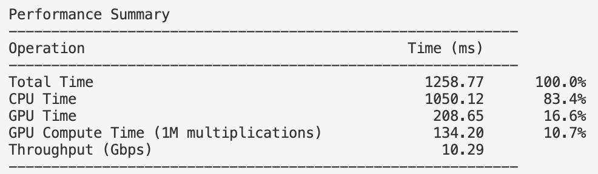
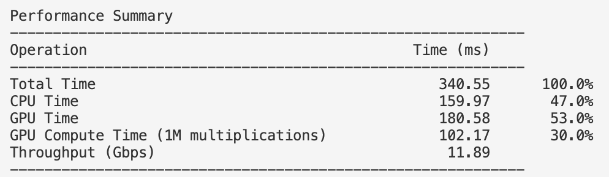

# webgpu-poc

This repo aims to provide meaningful benchmarks for WebGPU performance in Rust.

## Benchmarks

- [x] Compute Profile
- [ ] Buffer Copy Compute

## Running the benchmarks

Run `cargo run` to run the benchmarks.

## Performance Summary

Currently, the only benchmark is for profiling the entire WebGPU pipeline.

### Run 1M multiplications on MacBook Pro M1 Pro (single thread)

#### Debug

#### Release

